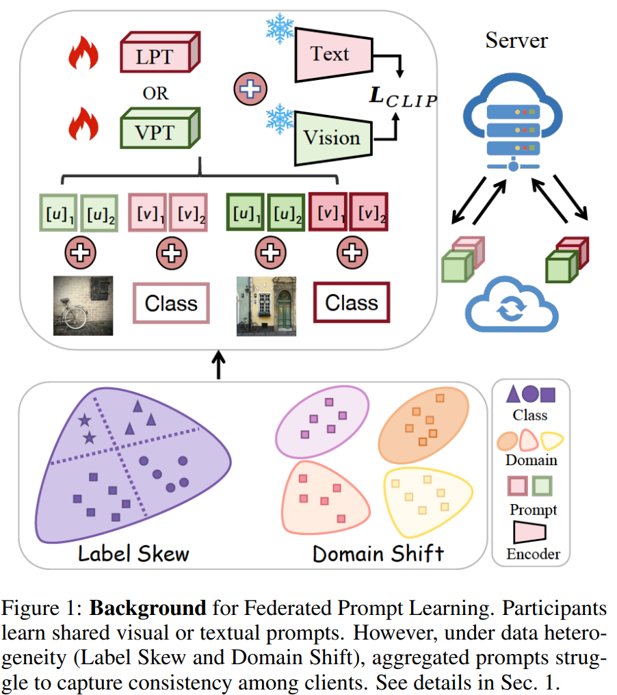

# An Empirical Study of Federated Prompt Learning for Vision Language Model 

>An Empirical Study of Federated Prompt Learning for Vision Language Model. *IJCAI,2025* [Arxiv](https://arxiv.org/abs/2505.23024)

## Content

### 🙌Abstract
The Vision Language Model (VLM) excels in aligning vision and language representations, and prompt learning has emerged as a key technique for adapting such models to downstream tasks. However, the application of prompt learning with VLM in federated learning (\fl{}) scenarios remains underexplored. This paper systematically investigates the behavioral differences between language prompt learning (LPT) and vision prompt learning (VPT) under data heterogeneity challenges, including label skew and domain shift. We conduct extensive experiments to evaluate the impact of various \fl{} and prompt configurations, such as client scale, aggregation strategies, and prompt length, to assess the robustness of Federated Prompt Learning (FPL). Furthermore, we explore strategies for enhancing prompt learning in complex scenarios where label skew and domain shift coexist, including leveraging both prompt types when computational resources allow. Our findings offer practical insights into optimizing prompt learning in federated settings, contributing to the broader deployment of VLMs in privacy-preserving environments.

### 📖Paper List

#### Federated Learning

1. [arXiv16] Federated Optimization: Distributed Machine Learning for On-Device Intelligence. [[Paper]](https://arxiv.org/abs/1610.02527)
2. [AISTATS17] Communication-Efficient Learning of Deep Networks from Decentralized Data. [[Paper]](https://proceedings.mlr.press/v54/mcmahan17a.html)
3. [arXiv18] Federated learning with Non-IID Data. [[Paper]](https://arxiv.org/abs/1806.00582)
4. [arXiv19] Advances and Open Problems in Federated Learning. [[Paper]](https://arxiv.org/abs/1912.04977)
5. [SPM20] Federated Learning: Challenges, Methods, and Future Directions. [[Paper]](https://ieeexplore.ieee.org/abstract/document/9084352)
6. [MLSys20] Federated Optimization in Heterogeneous Networks. [[Paper]](https://proceedings.mlsys.org/paper_files/paper/2020/hash/1f5fe83998a09396ebe6477d9475ba0c-Abstract.html)
7. [TPDS20] Accelerating Federated Learning via Momentum Gradient Descent. [[Paper]](https://ieeexplore.ieee.org/document/9003425)
8. [ICLR21] FedBN: Federated Learning on Non-IID Features via Local Batch Normalization. [[Paper]](https://openreview.net/forum?id=6YEQUn0QICG)
9. [TNNLS21] Clustered Federated Learning: Model-Agnostic Distributed Multitask Optimization Under Privacy Constraints. [[Paper]](https://ieeexplore.ieee.org/document/9174890)
10. [NIPS21] No Fear of Heterogeneity: Classifier Calibration for Federated Learning with Non-IID Data. [[Paper]](https://dl.acm.org/doi/10.5555/3540261.3540718)
11. [CVPR21] Model-Contrastive Federated Learning. [[Paper]](https://ieeexplore.ieee.org/document/9578660)
12. [ICDE22] Federated Learning on Non-IID Data Silos: An Experimental Study. [[Paper]](https://ieeexplore.ieee.org/document/9835537)
13. [FGCS22] A state-of-the-art survey on solving non-IID data in Federated Learning. [[Paper]](https://www.sciencedirect.com/science/article/abs/pii/S0167739X22001686)
14. [CVPR22] Learn from Others and Be Yourself in Heterogeneous Federated Learning. [[Paper]](https://ieeexplore.ieee.org/document/9879190)
15. [AAAI23] Federated Learning on Non-IID Graphs via Structural Knowledge Sharing. [[Paper]](https://dl.acm.org/doi/abs/10.1609/aaai.v37i8.26187)
16. [AAAI23] Tackling Data Heterogeneity in Federated Learning with Class Prototypes. [[Paper]](https://dl.acm.org/doi/abs/10.1609/aaai.v37i6.25891)
17. [CVPR23] Rethinking Federated Learning with Domain Shift: A Prototype View. [[Paper]](https://ieeexplore.ieee.org/abstract/document/10203389)
18. [ICDE24] FedCross: Towards Accurate Federated Learning via Multi-Model Cross-Aggregation. [[Paper]](https://ieeexplore.ieee.org/document/10597740/)
19. [AAAI24] FedMut: Generalized Federated Learning via Stochastic Mutation. [[Paper]](https://ojs.aaai.org/index.php/AAAI/article/view/29146)
20. [TPAMI24] Federated Learning for Generalization, Robustness, Fairness: A Survey and Benchmark. [[Paper]](https://ieeexplore.ieee.org/document/10571602)

#### Prompt Learning

1. [EMNLP20] Autoprompt: Eliciting knowledge from language models with automatically generated prompts. [[Paper]](https://aclanthology.org/2020.emnlp-main.346/)

2. [EMNLP21] The Power of Scale for Parameter-Efficient Prompt Tuning. [[Paper]](https://aclanthology.org/2021.emnlp-main.243/)
3. [IJCV22] Learning to prompt for vision-language models. [[Paper]](https://dl.acm.org/doi/abs/10.1007/s11263-022-01653-1)
4. [ECCV22] Visual Prompt Tuning. [[Paper]](https://dl.acm.org/doi/abs/10.1007/978-3-031-19827-4_41)
5. [CVPR23] Visual-Language Prompt Tuning with Knowledge-Guided Context Optimization. [[Paper]](https://openaccess.thecvf.com/content/CVPR2023/papers/Yao_Visual-Language_Prompt_Tuning_With_Knowledge-Guided_Context_Optimization_CVPR_2023_paper.pdf)
6. [ICLR23] PLOT: Prompt Learning with Optimal Transport for Vision-Language Models. [[Paper]](https://openreview.net/forum?id=zqwryBoXYnh)
7. [ICCV23] Self-regulating Prompts: Foundational Model Adaptation without Forgetting. [[Paper]](https://openaccess.thecvf.com/content/ICCV2023/papers/Khattak_Self-regulating_Prompts_Foundational_Model_Adaptation_without_Forgetting_ICCV_2023_paper.pdf)
8. [CVPR23] MaPLe: Multi-modal Prompt Learning.  [[Paper]](https://openaccess.thecvf.com/content/CVPR2023/papers/Khattak_MaPLe_Multi-Modal_Prompt_Learning_CVPR_2023_paper.pdf)
9. [CVPR24] Active Prompt Learning in Vision Language Models. [[Paper]](https://openaccess.thecvf.com/content/CVPR2024/papers/Bang_Active_Prompt_Learning_in_Vision_Language_Models_CVPR_2024_paper.pdf)
10. [CVPR24] Promptkd: Unsupervised prompt distillation for vision-language models. [[Paper]](https://openaccess.thecvf.com/content/CVPR2024/papers/Li_PromptKD_Unsupervised_Prompt_Distillation_for_Vision-Language_Models_CVPR_2024_paper.pdf)

#### Federated Prompt Learning

1. [TMC23] Promptfl: Let federated participants cooperatively learn prompts instead of models-federated learning in age of foundation model. [[Paper]](https://dl.acm.org/doi/abs/10.1109/TMC.2023.3302410)
2. [IEEE DEB23] FedCLIP: Fast Generalization and Personalization for CLIP in Federated Learning. [[Paper]](https://arxiv.org/abs/2302.13485v1)
3. [arXiv23] Dual Prompt Tuning for Domain-Aware Federated Learning. [[Paper]](https://arxiv.org/abs/2310.03103v3)
4. [arXiv23] A systematic survey of prompt engineering on vision-language foundation models. [[Paper]](https://arxiv.org/abs/2307.12980)
5. [ICCV23] Exploring the benefits of visual prompting in differential privacy. [[Paper]](https://openaccess.thecvf.com/content/ICCV2023/papers/Li_Exploring_the_Benefits_of_Visual_Prompting_in_Differential_Privacy_ICCV_2023_paper.pdf)
6. [ICCV23] Efficient model personalization in federated learning via client-specific prompt generation. [[Paper]](https://openaccess.thecvf.com/content/ICCV2023/papers/Yang_Efficient_Model_Personalization_in_Federated_Learning_via_Client-Specific_Prompt_Generation_ICCV_2023_paper.pdf)
7. [WWW23] Pfedprompt: Learning personalized prompt for vision-language models in federated learning. [[Paper]](https://dl.acm.org/doi/10.1145/3543507.3583518)
8. [CVPR23] Learning Federated Visual Prompt in Null Space for MRI Reconstruction. [[Paper]](https://openaccess.thecvf.com/content/CVPR2023/papers/Feng_Learning_Federated_Visual_Prompt_in_Null_Space_for_MRI_Reconstruction_CVPR_2023_paper.pdf)
9. [AAAI24] Federated Adaptive Prompt Tuning for Multi-Domain Collaborative Learning. [[Paper]](https://ojs.aaai.org/index.php/AAAI/article/download/29434/30706)
10. [ICLR24] Federated Text-driven Prompt Generation for Vision-Language Models. [[Paper]](https://openreview.net/forum?id=NW31gAylIm)
11. [CVPR24] Global and Local Prompts Cooperation via Optimal Transport for Federated Learning. [[Paper]](https://openaccess.thecvf.com/content/CVPR2024/papers/Li_Global_and_Local_Prompts_Cooperation_via_Optimal_Transport_for_Federated_CVPR_2024_paper.pdf)

#### Others

1. [Citer09] Learning multiple layers of features from tiny images. [[Paper]](https://www.cs.toronto.edu/~kriz/cifar.html)
2. [ECCV10] Adapting visual category models to new domains. [[Paper]](https://dl.acm.org/doi/10.5555/1888089.1888106)
3. [CVPR17] Deep Hashing Network for Unsupervised Domain Adaptation. [[Paper]](https://ieeexplore.ieee.org/document/8100055)
4. [arXiv18] Representation Learning with Contrastive Predictive Coding. [[Paper]](https://arxiv.org/abs/1807.03748)
5. [ICCV19] Moment matching for multi-source domain adaptation. [[Paper]](https://ieeexplore.ieee.org/document/9010750)
6. [NIPS20] Language models are few-shot learners. [[Paper]](https://dl.acm.org/doi/abs/10.5555/3495724.3495883)
7. [ICML21] Learning Transferable Visual Models From Natural Language Supervision. [[Paper]](https://icml.cc/virtual/2021/oral/9194)

